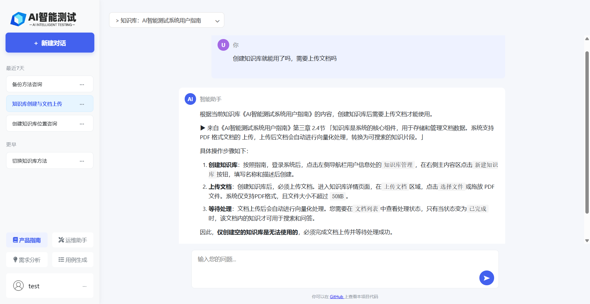
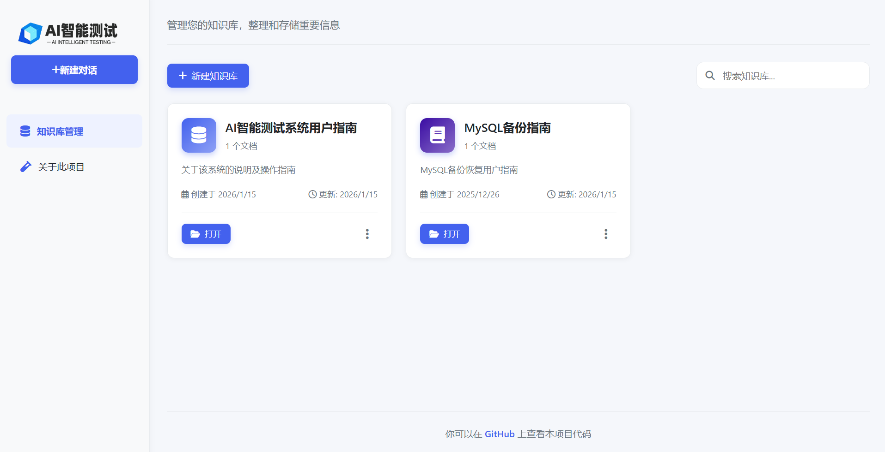

# AI 智能测试系统

​	本系统是一个基于人工智能技术的测试辅助平台，通过集成检索增强生成（RAG）技术，使得系统能够从上传的知识库文档中提取关键信息，并结合大语言模型生成高质量的测试相关内容，帮助测试人员更高效地进行测试需求分析、测试用例生成和问题排查。

​	项目 Demo 地址：http://119.91.21.107:8000/

## 主要功能

-  需求梳理与测试策略设计

- 测试场景和测试点分析
- 基于RAG知识库的测试用例生成
- 产品问题排查与用户手册阅读



本系统主要基于Python 的 FastAPI 框架和 LangChain 构建，核心 RAG 功能包括：

- 文档内容提取(目前支持 PDF 文件)
- 向量化存储
- 基于语义相似度的上下文检索
- 检索增强的问答生成

## 待实现功能 Todo List

在开发此系统时，意识到当前所做的功能仍有很大的优化空间，因此在此列个 Todo List，后续有时间会继续完善。

1. 增加更多文档源的支持，如数据库、API 文档等

2. 优化向量化存储和检索算法，提高响应速度和准确性

3. 保存生成的测试用例，记录版本

4. AI辅助测试用例评审，检查测试用例的完整性和覆盖度

5. 自动将生成的测试用例同步到主流工具（如TestRail、Jira）

6. 权限管理：区分不同用户或角色,细分知识库的访问和操作权限

7. 允许用户自定义测试用例的生成模版和规则

8. 集成更多AI模型，提升生成质量

   ......

**页面展示**

- chat页面

  

- 知识库管理页面

  

- 知识库详情/文档管理页面

  

## 技术栈

- **Python/FastAPI** 

- **LangChain** 

- **MySQL** 

- **JavaScript**

  

## 涉及模型

- 嵌入模型：**阿里百炼 text-embedding-v4**
- LLM 模型：**DeepSeek**


## 本地部署

### 前提条件
- 自行申请 DeepSeek、阿里百炼的 API KEY

### 部署步骤

1. **克隆仓库**
   ```bash
   git clone https://github.com/ChiufungLee/RAG_TestCases_Generator.git
   ```
   
2. **安装依赖**
   ```bash
   pip install -r requirements.txt
   ```

3. **配置环境变量**
   在根目录创建 `.env` 文件，然后填入你的配置：
   ```env
   # 数据库配置
   MYSQL_USER=your_user
   MYSQL_PASSWORD=your_password
   MYSQL_HOST=mysql_host
   MYSQL_PORT=mysql_port
   MYSQL_DATABASE=aitest_rag
   
   # API Keys
   DEEPSEEK_API_KEY="your_deepseek_api_key"
   ALIYUN_API_KEY="your_ali_api_key"
   ALIYUN_BASE_URL = "https://dashscope.aliyuncs.com/compatible-mode/v1"
   
   # 向量存储配置
   # RAG_DB_PATH=./chroma_db
   RAG_DB_PATH = "./chroma_db/local_rag_db"
   
   # 文件上传配置
   UPLOAD_DIR=./uploads
   ```
   
4. **启动应用**
   ```bash
   uvicorn main:app --host 0.0.0.0 --port 8000 --reload
   ```

5. **访问应用**
   打开浏览器访问 [http:/yourhost:8000](http://localhost:8000)


## 项目结构

```text
$ tree
├── ai_rag_test.log
├── api
│   ├── api_v1.py
│   ├── endpoints
│   │   ├── auth.py
│   │   ├── chat.py
│   │   ├── func.py
│   │   ├── knowledg_api.py
│   │   └── users.py
├── chroma_db
│   ├── local_rag_db
├── main.py
├── models
│   ├── chat.py
│   ├── database.py
│   ├── knowledge_models.py
│   └── user.py
├── prompts
│   ├── __init__.py
│   ├── prompts.py
├── README.md
├── requirements.txt
├── schemas
│   ├── knowledge_schemas.py
│   └── user_schemas.py
├── services
│   ├── auth_service.py
│   ├── chat_service.py
│   └── knowlege_service.py
├── static
│   ├── css
│   ├── js
│   ├── images
├── templates
│   ├── func_main.html
│   ├── index.html
│   ├── knowledge_detail.html
│   ├── login.html
│   └── register.html
├── uploads
└── utils
    ├── data_handle.py
    ├── file_handle.py
    ├── __init__.py
    ├── llm_handle.py
    └── retriever.py

```

## API 文档

启动服务后访问以下端点查看 API 文档：
- Swagger UI: [http://localhost:8000/docs](http://localhost:8000/docs)
- ReDoc: [http://localhost:8000/redoc](http://localhost:8000/redoc)

**联系信息**

如果您在使用的过程中有任何建议或反馈，欢迎随时联系我：
- 邮箱：lzfdd937@163.com
- 创建 GitHub Issues: [https://github.com/ChiufungLee/RAG_TestCases_Generator/issues

